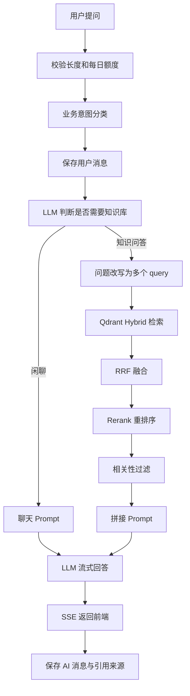

# AegisDesk AI

AegisDesk AI 是一个基于大语言模型和 RAG 架构的企业智能客服系统。项目实现了用户注册登录、会话管理、知识库管理、向量检索、LLM 流式问答、引用来源展示、回答反馈、业务意图标注和每日提问次数限制等能力。

项目目标是完整展示一条企业级 AI 客服链路：

```text
用户提问 -> 业务意图分类 -> 多轮上下文 -> 知识库检索 -> Rerank -> Prompt 拼接 -> LLM 流式回答 -> 保存消息与引用来源
```

## 核心功能

### 用户与会话

- 邮箱或手机号注册、登录。
- JWT 鉴权。
- 新建独立会话 Session。
- 查看历史会话列表和完整会话详情。
- 删除会话时同步清理消息、引用来源和反馈数据。
- 支持多轮对话，后端会携带最近历史消息。

### AI 问答

- SSE 流式输出，前端逐字展示 AI 回答。
- 发送后展示“正在思考...”友好提示。
- 单次提问长度限制为 500 字。
- 每个用户每日提问次数上限可配置，默认 100 次。
- 本地业务意图分类，并在用户消息旁标注；分类按“投诉 > 售后问题 > 产品咨询 > 闲聊 > 其他”优先级匹配，带负面情绪的产品表达会优先归为投诉。
  - 产品咨询
  - 售后问题
  - 闲聊
  - 投诉
  - 其他

### 知识库管理

- 上传企业共享知识库文档。
- 文档解析、清洗、智能切分；QA 文档会按“一问一答一个 chunk”切分，普通文档继续按段落递归切分。
- chunk 写入 MySQL。
- Embedding 向量写入 Qdrant。
- 展示文档列表、上传时间、状态和 chunk 数量。
- 删除知识库文档时同步删除 MySQL chunk 和 Qdrant 向量。
- 所有登录用户共享同一套企业知识库。

当前代码支持 `.txt`、`.md` 文档上传；依赖中已包含 PyMuPDF，后续可扩展 `.pdf`。

### RAG 检索与生成

- LLM 意图路由：判断普通聊天或知识问答。
- LLM 问题改写：将一个问题扩展成多个 query。
- QA 文档按问答对切分，减少一个 chunk 混入多个无关问答导致的 Rerank 分数偏低。
- Qdrant Hybrid 检索：dense vector + sparse vector。
- 多 query 召回后进行外层 RRF 融合。
- 百炼/通义 Rerank 重排序。
- 相关性过滤，避免不相关知识片段进入 Prompt。
- AI 回答展示引用文件和片段摘要。

### 反馈

- 对 AI 回答点赞或踩。
- 踩时可填写文字反馈。
- 刷新历史会话后保留反馈状态。

## 技术栈

### 前端

- React
- TypeScript
- Vite
- Ant Design

### 后端

- Python
- FastAPI
- SQLAlchemy
- MySQL
- SSE

### AI 与向量能力

- LLM：OpenAI 兼容接口，默认适配通义千问兼容模式。
- Embedding：OpenAI text-embedding 或兼容接口。
- Vector DB：Qdrant。
- Rerank：百炼/通义 Rerank API。
- AI 编排：LangChain + LangGraph。

## 项目结构

```text
aegisdesk-ai/
├── backend/
│   ├── app/
│   │   ├── api/                 # FastAPI 路由
│   │   ├── core/                # 配置、数据库、日志、安全
│   │   ├── models/              # SQLAlchemy 模型
│   │   ├── prompts/             # Prompt 模板
│   │   ├── schemas/             # Pydantic DTO
│   │   ├── services/            # RAG、LLM、Embedding、Qdrant、文档解析
│   │   └── utils/               # 文本切分等工具
│   ├── 数据库初始化脚本/
│   ├── requirements.txt
│   └── .env.example
├── frontend/
│   ├── src/
│   │   ├── api/                 # 前端 API 封装
│   │   ├── pages/               # 登录、注册、聊天、知识管理页面
│   │   ├── App.tsx
│   │   └── styles.css
│   └── package.json
├── docs/
│   ├── API文档.md
│   ├── 数据库设计.md
│   ├── AI架构设计.md
│   └── 业务流程说明.md
├── 项目说明.md
├── 运行指南.md
└── README.md
```

## 快速启动

### 1. 初始化数据库

```powershell
cd backend
mysql -uroot -p < 数据库初始化脚本/init.sql
```

### 2. 启动后端

```powershell
cd backend
python -m venv .venv
.venv\Scripts\activate
pip install -r requirements.txt
copy .env.example .env
uvicorn app.main:app --reload --port 8000
```

启动后访问：

```text
http://127.0.0.1:8000/health
```

### 3. 启动前端

```powershell
cd frontend
npm install
npm run dev
```

访问：

```text
http://localhost:5173
```

如果 npm 下载较慢，可以使用国内镜像：

```powershell
npm install --registry=https://registry.npmmirror.com
```

## 关键环境变量

后端配置文件为：

```text
backend/.env
```

模板文件为：

```text
backend/.env.example
```

主要配置项：

```env
MYSQL_HOST=localhost
MYSQL_PORT=3306
MYSQL_USER_NAME=root
MYSQL_USER_PASSWORD=password
MYSQL_DB_NAME=aegisdeskAI

QDRANT_URL=http://localhost:6333
QDRANT_API_KEY=
QDRANT_COLLECTION=knowledge_chunks

LLM_BASE_URL=https://dashscope.aliyuncs.com/compatible-mode/v1
LLM_API_KEY=replace-with-your-api-key
LLM_MODEL=qwen-plus

EMBEDDING_BASE_URL=https://api.openai.com/v1
EMBEDDING_API_KEY=replace-with-your-embedding-api-key
EMBEDDING_MODEL=text-embedding-3-small

RERANK_URL=https://dashscope.aliyuncs.com/api/v1/services/rerank/text-rerank/text-rerank
RERANK_API_KEY=replace-with-your-bailian-api-key
RERANK_MODEL=gte-rerank-v2

DAILY_QUESTION_LIMIT=100
MAX_QUESTION_LENGTH=500
RAG_TOP_K=6
RAG_REWRITE_QUERY_COUNT=3
RAG_RECALL_PER_QUERY=10
RAG_RRF_TOP_K=20
RAG_RRF_K=60
RAG_SCORE_THRESHOLD=0.5
```

## 核心接口

接口前缀：

```text
/api/v1
```

常用接口：

| 模块  | 方法     | 路径                                   | 说明       |
| --- | ------ | ------------------------------------ | -------- |
| 认证  | POST   | `/auth/register`                     | 注册       |
| 认证  | POST   | `/auth/login`                        | 登录       |
| 会话  | GET    | `/sessions`                          | 会话列表     |
| 会话  | GET    | `/sessions/{session_id}`             | 会话详情     |
| 会话  | DELETE | `/sessions/{session_id}`             | 删除会话     |
| 聊天  | GET    | `/chat/quota`                        | 查询今日提问额度 |
| 聊天  | POST   | `/chat/stream`                       | SSE 流式问答 |
| 知识库 | POST   | `/knowledge/documents`               | 上传文档     |
| 知识库 | GET    | `/knowledge/documents`               | 文档列表     |
| 知识库 | DELETE | `/knowledge/documents/{document_id}` | 删除文档     |
| 反馈  | POST   | `/feedback`                          | 提交点赞/踩   |

完整说明见：

- [docs/API文档.md](docs/API文档.md)

## RAG 流程



详细设计见：

- [docs/AI架构设计.md](docs/AI架构设计.md)
- [docs/业务流程说明.md](docs/业务流程说明.md)

## 数据库设计

MySQL 主要表：

- `users`
- `chat_sessions`
- `chat_messages`
- `knowledge_documents`
- `knowledge_chunks`
- `message_sources`
- `feedbacks`
- `user_daily_question_usages`

知识库文档和向量是企业共享数据；会话、反馈和每日提问次数仍按用户隔离。向量数据存储在 Qdrant，MySQL 中保存文档、chunk、消息和引用元数据。

详细表结构见：

- [docs/数据库设计.md](docs/数据库设计.md)

## 日志

后端日志文件：

```text
backend/logs/app.log
```

LLM、Embedding、Qdrant、Rerank 等异常会写入日志。前端只展示用户友好的错误提示，避免直接暴露技术错误。

# 

## 更多文档

- [项目说明.md](项目说明.md)
- [运行指南.md](运行指南.md)
- [docs/API文档.md](docs/API文档.md)
- [docs/数据库设计.md](docs/数据库设计.md)
- [docs/AI架构设计.md](docs/AI架构设计.md)
- [docs/业务流程说明.md](docs/业务流程说明.md)
