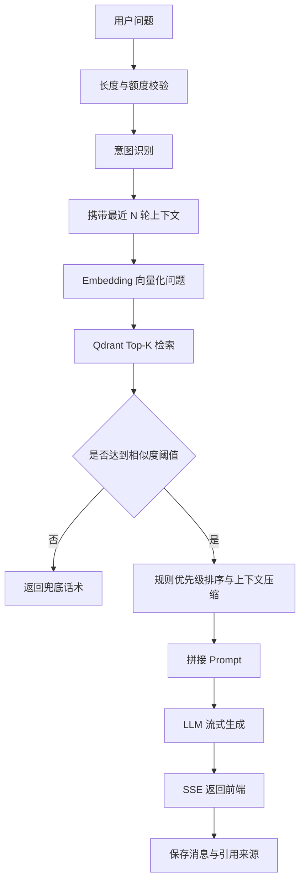

# AI 架构设计

## RAG 流程

## Prompt 设计

系统提示词核心约束：

- 只能基于知识库内容回答。
- 不允许编造知识库中不存在的规则。
- 检索不足时明确说明无法准确回答。
- 回答需要简洁，并说明依据。

## 检索策略

- Top-K：默认 6。
- 相似度阈值：默认 0.5。
- 文档状态过滤：只检索 `ready` 文档。
- 多知识库扩展：先做知识库路由，再在目标知识库内检索。

## 幻觉控制

- 空检索直接兜底。
- 低分片段不进入 Prompt。
- 高优先级业务规则前置。
- 答案保存引用来源，方便人工追溯。
