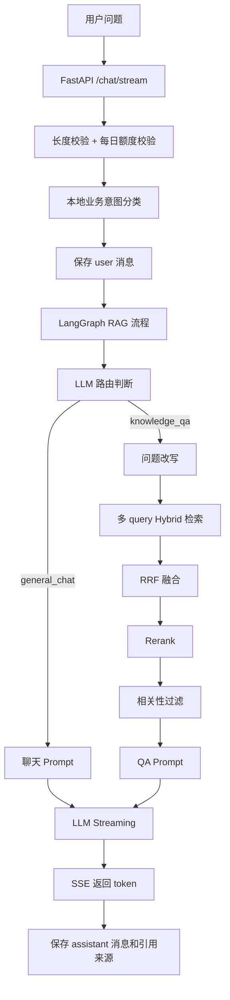

# AI 架构设计

## 1. 总体架构

AegisDesk AI 使用 RAG 架构，将企业知识库与大语言模型结合。前端不直接调用 LLM，所有模型调用、向量检索和 Rerank 均在后端完成。

知识库按企业维度共享，所有登录用户检索同一套文档和向量；用户维度仍用于会话、反馈和每日提问额度。



## 2. Prompt 模板设计

系统主要有四类 Prompt：

### 意图路由 Prompt

判断问题是否需要知识库：

```text
只允许输出 knowledge_qa 或 general_chat。
普通问候、身份问题、感谢等输出 general_chat。
概念、资料、业务规则、文档相关问题输出 knowledge_qa。
```

### Query Rewrite Prompt

将用户问题改写为多个适合检索的 query：

```text
保留原始意图。
覆盖定义、规则、同义表达等角度。
输出 JSON 数组，不输出解释。
```

### QA Prompt

知识库命中时使用：

```text
你是企业智能客服助手。请严格基于知识库内容回答。
不允许编造知识库中不存在的规则、价格、政策或承诺。
如果知识库没有相关内容，请说明暂时无法准确回答。
回答要清晰、简洁、可执行。
```

### No Knowledge Prompt

没有可靠知识片段时使用：

```text
可以基于通用知识简洁回答。
如果涉及企业内部政策、价格、承诺、合同、售后规则等，需要说明当前没有检索到依据。
不得编造企业内部规则、价格、政策或承诺。
```

## 3. 检索策略

### 文档处理

```text
上传文档 -> 解析文本 -> 清洗文本 -> 智能切分 -> 写入 MySQL -> 写入 Qdrant
```

当前文本切分默认：

```text
chunk_size = 800
overlap = 100
```

切分器会先根据正文结构识别 QA 文档，支持 `Q：/A：`、`Q:/A:`、`问：/答：`、`问题：/答案：`，并兼容 `1. Q：...` 这类编号前缀。识别出 3 组及以上问答时，按“一问一答一个 chunk”切分；否则回退到普通递归文本切分。

前端在上传动作发起后会立即显示“处理中”状态，避免用户在文档解析、Embedding 和 Qdrant 写入期间误以为没有响应。

### Hybrid 检索

系统在 Qdrant 中保存：

- dense vector：Embedding 模型生成的语义向量。
- sparse vector：基于关键词 token 构造的稀疏向量。
- payload：保存 `document_id`、`chunk_id`、`doc_name`、`content`、`summary` 等企业知识库元数据。

检索时同时发起 dense 和 sparse prefetch，再使用 Qdrant RRF 融合。

### 多路召回

用户问题会先由 LLM 改写为多个 query：

```text
原问题 + 改写 query 1 + 改写 query 2 + 改写 query 3
```

每个 query 单独进行 hybrid 检索，然后在应用层进行外层 RRF 融合。

### Rerank

RRF 后的候选片段会调用百炼/通义 Rerank API，得到最终排序。配置项：

```text
RERANK_MODEL=gte-rerank-v2
RAG_TOP_K=6
RAG_SCORE_THRESHOLD=0.5
```

### 相关性过滤

系统不会把所有召回结果都作为引用：

- 如果存在 rerank_score，则按 `RAG_SCORE_THRESHOLD` 过滤。
- 如果没有可靠 rerank_score，则按业务意图关键词做兜底过滤。
- 不相关片段会被清空，不进入 Prompt，也不展示引用。

## 4. 上下文策略

每次问答携带当前 session 最近 10 条消息：

```text
history = 最近 10 条 user/assistant 消息
```

这样可以支持：

- “我上一个问题是什么”
- “继续说”
- “它是什么意思”

后续可扩展为：

```text
会话摘要 + 最近 N 条原文消息
```

## 5. 防幻觉策略

当前实现包含：

- 知识库命中时要求严格基于知识片段回答。
- 知识库未命中时使用兜底 Prompt，不允许编造企业内部规则。
- Rerank 和阈值过滤减少无关 chunk。
- 对售后、投诉等业务问题进行业务意图关键词过滤；业务意图按“投诉 > 售后 > 产品咨询 > 闲聊 > 其他”匹配，负面投诉表达优先于产品词。
- 引用来源来自实际保存的 message_sources，不由模型自由生成。

## 6. 大规模知识库扩展设计

当企业文档规模变大时，可以进一步增加：

1. 分层摘要：先对同文档多 chunk 汇总，再给 LLM。
2. 规则优先级：政策类、价格类、售后类规则高优先级保留。
3. 冲突检测：不同文档出现冲突规则时提示人工确认。
4. 二次校验：回答生成后再用 LLM 检查是否每条结论都有来源。
5. 来源压缩：同一文档多个 chunk 合并为一个引用摘要，避免注意力稀释。

## 7. 评估方式

人工构造测试问题：

- 知识库内问题：应能回答并显示正确引用。
- 知识库外问题：应不显示引用，并给出兜底回答。
- 售后问题：如果没有售后文档，不应引用无关资料。
- 多轮问题：应能理解上一轮上下文。
- 幻觉测试：询问不存在的价格、承诺、政策，应明确无依据。
