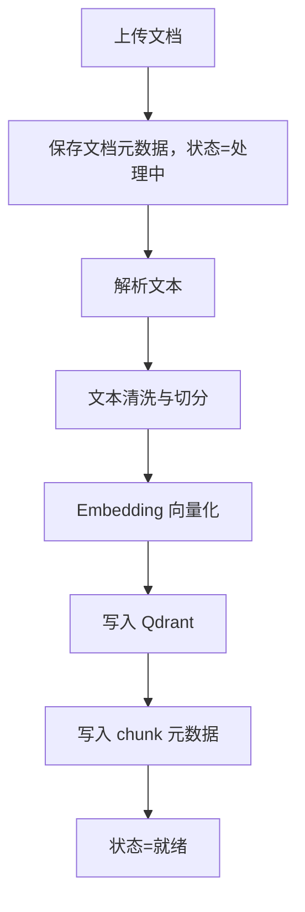

# 业务流程说明

## 知识库流程

## 问答流程

1. 用户登录后进入会话。
2. 用户输入问题。
3. 后端校验长度、登录态和每日额度。
4. 系统识别意图并记录。
5. 系统检索相关知识片段。
6. 检索为空时返回兜底话术。
7. 检索命中时拼接 Prompt 并调用 LLM。
8. 后端通过 SSE 将回答逐字返回前端。
9. 回答结束后保存消息、引用来源和追问建议。
10. 用户可对回答点赞、踩或补充文字反馈。
