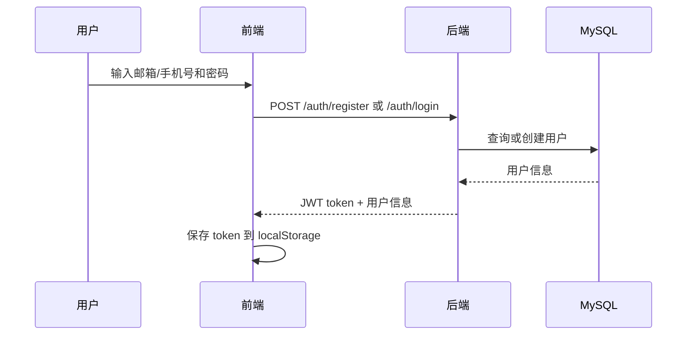
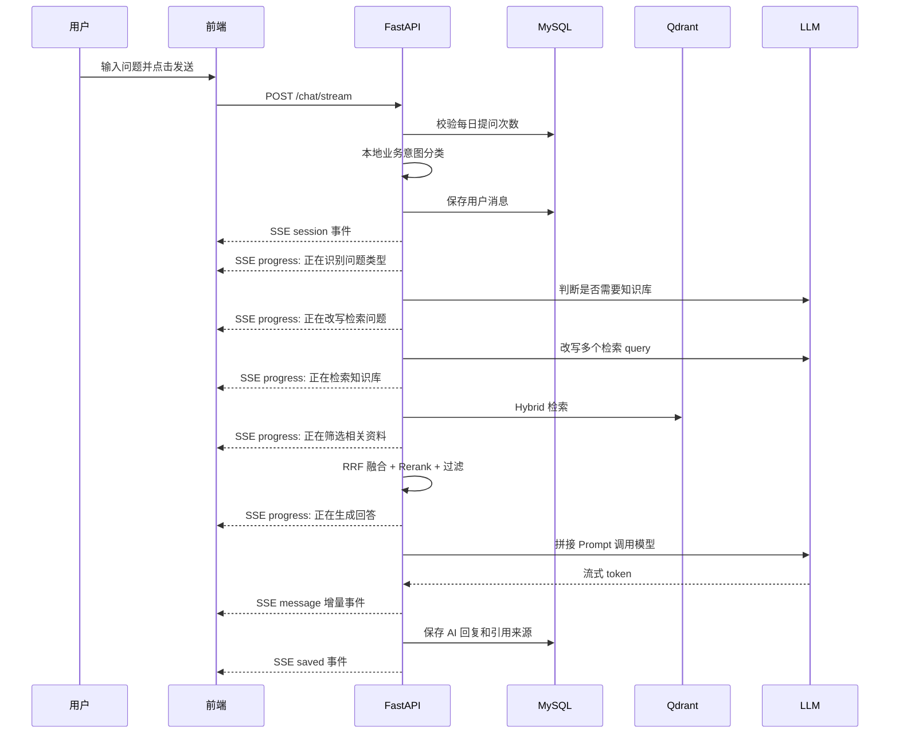
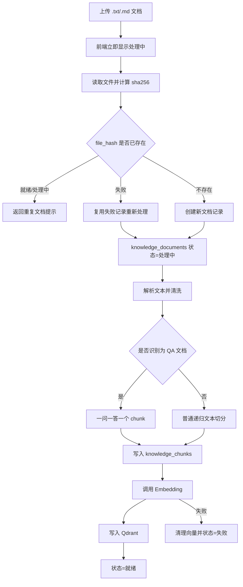
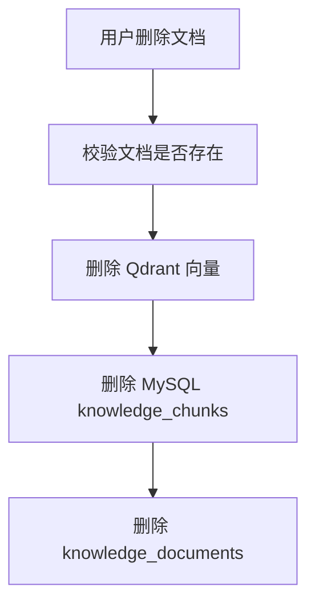
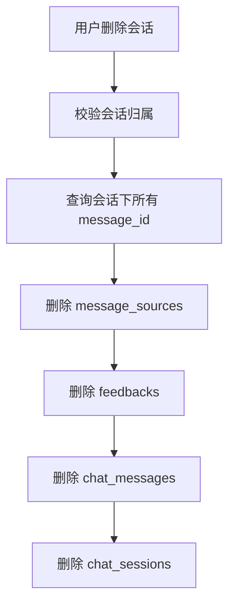
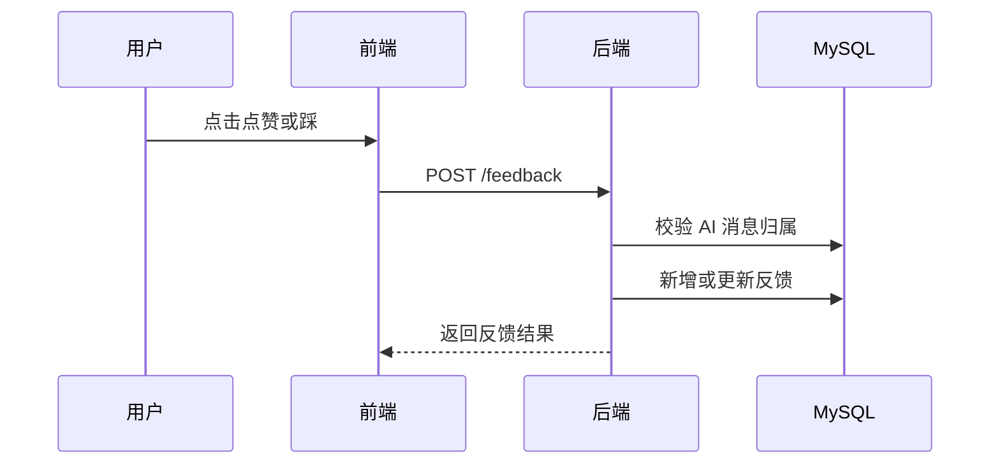

# 业务流程说明

## 1. 用户注册登录流程

## 2. 发起问答流程

业务意图分类使用本地关键词规则，优先级为：投诉 > 售后问题 > 产品咨询 > 闲聊 > 其他。包含明显负面情绪的产品表达会优先标记为投诉。

问答过程中的 `progress` 事件只用于前端当前气泡展示，不保存到数据库；模型首个 token 到达后，进度文案会被正式回答替换。

## 3. 知识库上传流程

知识库为企业共享数据，登录用户只用于鉴权，不作为文档归属条件。

启动初始化开启时，FastAPI lifespan 会先创建 MySQL 数据库和表，再按同一套知识库导入逻辑扫描 `testdocs` 目录；已存在的同内容文档会按 `file_hash` 跳过。

## 4. 知识库删除流程

删除知识库文档会影响所有用户可见和可检索的企业知识库。

## 5. 会话删除流程

每日提问次数不会因为删除会话而减少。

## 6. 反馈流程

## 7. 异常处理流程

| 场景 | 处理方式 |
|---|---|
| LLM 认证失败、限流、超时 | 后端写日志，前端展示友好提示 |
| Embedding 失败 | 文档状态改为失败，清理已写入向量 |
| Qdrant 检索失败 | 后端日志记录，返回兜底回答 |
| 超过每日次数 | 拒绝发送，前端禁用输入框和发送按钮 |
| 文档无内容 | 文档状态改为失败并保存错误信息 |
