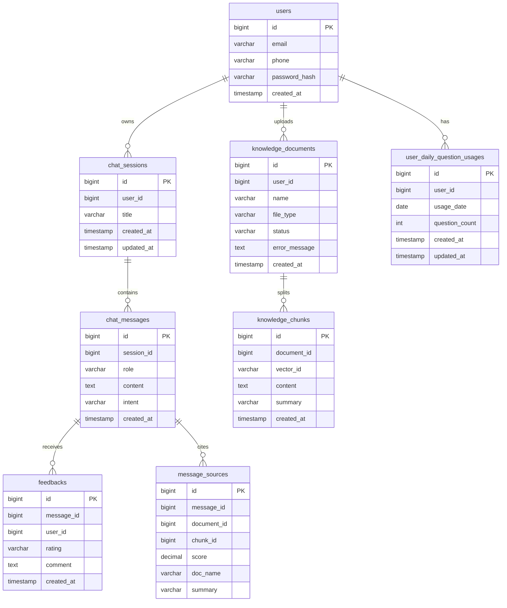

# 数据库设计

数据库使用 MySQL，主要存储用户、会话、消息、知识库元数据、反馈、引用来源和每日提问次数。向量数据存储在 Qdrant，MySQL 中只保存知识块文本和元数据。

## ER 图



## 表结构说明

### users

保存用户账号和密码哈希。

| 字段 | 说明 |
|---|---|
| `id` | 用户 ID |
| `email` | 邮箱，唯一 |
| `phone` | 手机号，唯一 |
| `password_hash` | 加密后的密码 |
| `created_at` | 注册时间 |

### chat_sessions

每次独立对话对应一个 session。

| 字段 | 说明 |
|---|---|
| `id` | 会话 ID |
| `user_id` | 所属用户 |
| `title` | 会话标题，默认取首条问题前 30 字 |
| `created_at` | 创建时间 |
| `updated_at` | 最后一次对话时间 |

### chat_messages

保存用户消息和 AI 回复。

| 字段 | 说明 |
|---|---|
| `id` | 消息 ID |
| `session_id` | 所属会话 |
| `role` | `user` 或 `assistant` |
| `content` | 消息内容 |
| `intent` | 用户消息的业务意图分类 |
| `created_at` | 创建时间 |

业务意图枚举：

| 存储值 | 展示文案 |
|---|---|
| `product_consultation` | 产品咨询 |
| `after_sales` | 售后问题 |
| `chat` | 闲聊 |
| `complaint` | 投诉 |
| `other` | 其他 |

### knowledge_documents

保存知识库文档元数据。

| 字段 | 说明 |
|---|---|
| `id` | 文档 ID |
| `user_id` | 上传用户 |
| `name` | 文件名 |
| `file_type` | 文件类型 |
| `status` | `处理中`、`就绪`、`失败` |
| `error_message` | 失败原因 |
| `created_at` | 上传时间 |

### knowledge_chunks

保存文档切片文本。

| 字段 | 说明 |
|---|---|
| `id` | chunk ID，同时作为 Qdrant point id |
| `document_id` | 所属文档 |
| `vector_id` | 向量 ID |
| `content` | 切片原文 |
| `summary` | 切片摘要 |
| `created_at` | 创建时间 |

### message_sources

保存 AI 回答引用了哪些知识片段。

| 字段 | 说明 |
|---|---|
| `message_id` | AI 消息 ID |
| `document_id` | 文档 ID |
| `chunk_id` | chunk ID |
| `score` | 相关性分数 |
| `doc_name` | 文档名快照 |
| `summary` | 片段摘要 |

### feedbacks

保存用户对 AI 回答的点赞或踩。

| 字段 | 说明 |
|---|---|
| `message_id` | AI 消息 ID |
| `user_id` | 用户 ID |
| `rating` | `like` 或 `dislike` |
| `comment` | 可选文字反馈 |

### user_daily_question_usages

独立记录每日提问次数，避免用户删除会话后绕过限制。

| 字段 | 说明 |
|---|---|
| `user_id` | 用户 ID |
| `usage_date` | 日期 |
| `question_count` | 当日已提问次数 |

唯一约束：

```text
(user_id, usage_date)
```

## 设计说明

- 删除会话时同步删除消息、引用来源和反馈。
- 删除知识库文档时同步删除 MySQL chunk 和 Qdrant 向量。
- 每日提问次数不依赖 `chat_messages`，因此不会被删除会话影响。
- `message_sources` 保存文档名快照，避免文档删除后历史回答引用显示为空。

