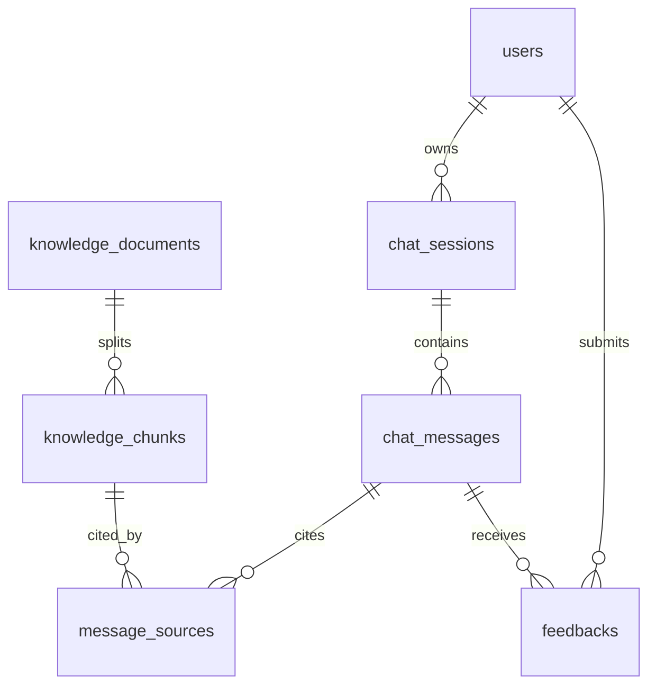

# 数据库设计

## 核心表

- `users`：用户账号、手机号、邮箱、密码哈希。
- `chat_sessions`：每次对话会话。
- `chat_messages`：用户消息与 AI 回复。
- `knowledge_documents`：知识库文档元数据和处理状态。
- `knowledge_chunks`：文档切片，与向量数据库 vector_id 关联。
- `message_sources`：AI 回答引用来源。
- `feedbacks`：点赞、踩、文字反馈。
