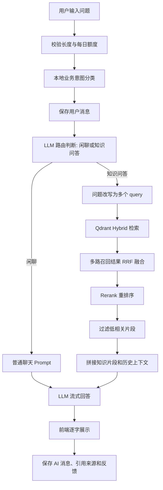

# AegisDesk AI 项目说明

## 1. 项目简介

AegisDesk AI 是一个基于大语言模型和 RAG 架构的企业智能客服系统。系统支持用户注册登录、独立会话、多轮问答、知识库上传、向量检索、流式回答、引用来源展示、AI 回答反馈、每日提问次数限制以及业务意图标注。

核心链路为：

```text
用户提问 -> 本地业务意图分类 -> 多轮上下文整理 -> 知识库检索 -> RRF/Rerank -> Prompt 拼接 -> LLM 流式回答 -> 保存消息与引用来源
```

## 2. 技术选型

前端使用 React + TypeScript + Ant Design。React 适合构建聊天界面这类状态变化频繁的应用，TypeScript 可以提高接口字段和组件状态的可靠性，Ant Design 提供了表单、表格、弹窗、上传等成熟组件。

后端使用 FastAPI + SQLAlchemy + MySQL。FastAPI 支持异步接口和 SSE 流式输出，适合 AI 对话场景；SQLAlchemy 负责 ORM 建模；MySQL 存储用户、会话、消息、知识库元数据、反馈和每日提问次数。

AI 相关能力：

- LLM：OpenAI 兼容接口，当前默认可接入通义千问兼容模式。
- Embedding：OpenAI text-embedding 或兼容接口。
- 向量库：Qdrant，支持云端部署、向量检索和 payload 过滤。
- Rerank：百炼/通义 Rerank API。
- 编排：LangChain + LangGraph，用于模型调用、Prompt 消息组织和 RAG 流程节点编排。

## 3. AI 架构概览



## 4. 关键工程设计

### 检索为空

当知识库没有检索到可靠片段时，不把不相关文档强行塞给模型，而是走无知识库兜底 Prompt。回答会说明当前未检索到依据，建议补充资料或联系人工确认。

### 上下文超长

当前实现携带最近 10 条会话消息，避免把完整历史无限制传给模型。后续可以增加会话摘要字段，将长对话压缩为“摘要 + 最近 N 轮原文”的结构。

### 减少幻觉

系统通过以下方式降低幻觉：

- 有知识片段时要求模型严格依据知识库回答。
- 没有知识片段时明确提示不得编造企业内部规则、价格、政策或承诺。
- 引用来源只展示经过过滤后的 chunk。
- 对召回结果进行 RRF 融合和 Rerank，减少单一路径误召回。
- 对售后、投诉等业务意图增加关键词相关性过滤，避免不相关文档被引用。

### 每日提问限制

每日额度独立存储在 `user_daily_question_usages` 表中，不依赖聊天消息数量。即使用户删除会话，也不会重置每日提问次数。

## 5. 已实现功能

- 用户注册、登录、JWT 鉴权。
- 新建会话、历史会话列表、会话详情、删除会话。
- SSE 流式问答。
- 多轮上下文携带。
- 知识库文档上传、解析、切分、入库、向量化。
- Qdrant Hybrid 检索、RRF、多 query 改写、Rerank。
- AI 回答引用来源展示。
- 点赞/踩及文字反馈。
- 每日提问次数限制。
- 业务意图分类并在会话记录中展示。
- 后端日志文件记录。

## 6. 使用 AI 编程工具的体会

本项目开发过程中使用 AI 编程助手辅助生成接口、前端页面、RAG 链路和文档草稿。AI 工具可以快速搭建基础结构，但在 RAG 场景中仍需要人工理解和修正关键逻辑。

实际修正包括：

- 将单纯向量检索升级为多 query 召回、RRF 和 Rerank。
- 发现不相关知识片段被引用后，增加业务意图相关性过滤。
- 将每日次数限制从统计聊天消息改为独立用量表，避免删除会话绕过限制。
- 修复流式回答保存时数据库 session 生命周期问题。
- 将错误信息从前端展示改为后端日志记录，提升用户体验。

## 7. RAG 质量验证方式

当前主要通过人工测试验证：

- 闲聊问题不应强制查询知识库。
- 知识库命中时回答应展示引用文件。
- 知识库未命中时应使用兜底话术，不展示无关引用。
- 售后问题如“我要退款”不应引用无关的马克思主义文档。
- 刷新页面后历史消息、反馈状态、引用来源应保持一致。

